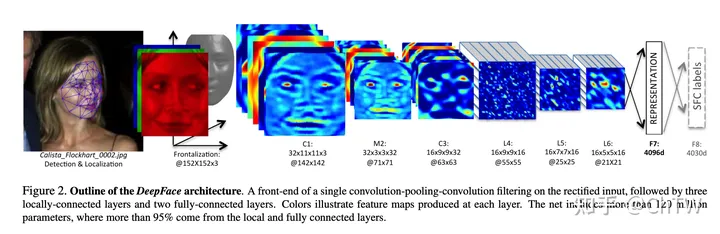

# 人脸识别

人脸识别的通常步骤为：**检测（detect）==>对齐（align）==>表示/特征提取（represent）==>分类（classify）**

### **模型结构**

## 1. 人脸识别模型

​	目前**最先进的**人脸识别模型：[`VGG-Face`](https://sefiks.com/2018/08/06/deep-face-recognition-with-keras/)、[`Google FaceNet`](https://sefiks.com/2018/09/03/face-recognition-with-facenet-in-keras/)、[`OpenFace`](https://sefiks.com/2019/07/21/face-recognition-with-openface-in-keras/)、[`Facebook DeepFace`](https://sefiks.com/2020/02/17/face-recognition-with-facebook-deepface-in-keras/)、[`DeepID`](https://sefiks.com/2020/06/16/face-recognition-with-deepid-in-keras/)、[`ArcFace`](https://sefiks.com/2020/12/14/deep-face-recognition-with-arcface-in-keras-and-python/)、[`Dlib`](https://sefiks.com/2020/07/11/face-recognition-with-dlib-in-python/) ，VGG-Face 模型

## 2. 相似度

​	人脸识别模型是常规[的卷积神经网络](https://sefiks.com/2018/03/23/convolutional-autoencoder-clustering-images-with-neural-networks/)，它们负责将人脸表示为向量。我们期望同一个人的一对面孔应该比一对不同的人的面孔[更相似](https://sefiks.com/2020/05/22/fine-tuning-the-threshold-in-face-recognition/)。

​	相似度可以通过不同的指标来计算，例如[余弦相似度](https://sefiks.com/2018/08/13/cosine-similarity-in-machine-learning/)、欧几里得距离和 L2 形式。默认配置使用余弦相似度。

## 3. **人脸检测器**

​	人脸检测和对齐是现代人脸识别管道的重要早期阶段。实验表明，仅对齐即可使人脸识别准确率提高近1%。[`OpenCV`](https://sefiks.com/2020/02/23/face-alignment-for-face-recognition-in-python-within-opencv/)、[`SSD、`](https://sefiks.com/2020/08/25/deep-face-detection-with-opencv-in-python/)[`Dlib`](https://sefiks.com/2020/07/11/face-recognition-with-dlib-in-python/)、[`MTCNN`](https://sefiks.com/2020/09/09/deep-face-detection-with-mtcnn-in-python/)、[`Faster MTCNN`](https://github.com/timesler/facenet-pytorch)、[`RetinaFace`](https://sefiks.com/2021/04/27/deep-face-detection-with-retinaface-in-python/)、[`MediaPipe`](https://sefiks.com/2022/01/14/deep-face-detection-with-mediapipe/)、[`YOLOv8 Face`](https://github.com/derronqi/yolov8-face) 和 [`YuNet`](https://github.com/ShiqiYu/libfacedetection) 

