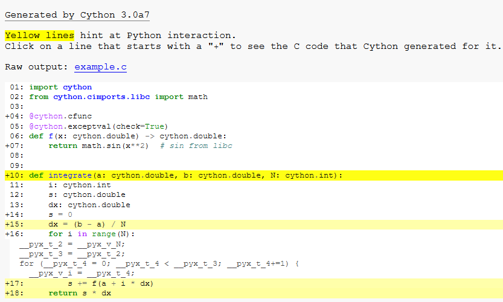

## 1. 安装 Cython

​	一般来讲anaconda 等包集成管理工具都捆绑了cython,无需设置。与大多数python解释器不同，cython 需要c编译器存在于系统上面，安装`cython`

```cmd
pip install Cython
```


- **Linux操作系统**GNU C 编译器 （gcc） 通常存在，或者很容易 可通过包装系统获得。

- **Mac OS X的**要检索 gcc，一种选择是安装 Apple 的 XCode，可以从 Mac OS X 的安装 DVD 或 从 https://developer.apple.com/。

- **窗户**CPython 项目建议构建扩展模块 （包括 Cython 模块）与 Python 相同的编译器 内置。这通常是 Microsoft Visual 的特定版本 C/C++ （MSVC） - 见 https://wiki.python.org/moin/WindowsCompilers。 MSVC 是 Cython 当前测试的唯一编译器 窗户。如果您在使 setuptools 检测时遇到困难 MSVC 和 [PyMSVC](https://github.com/kdschlosser/python_msvc) 旨在解决这个问题。

  ​	一个可能的替代方案是开源 MinGW（一个 gcc 的 Windows 发行版）。

​	

## 2. 构建Cython代码

​	与 Python 不同，必须编译 Cython 代码。这分两个阶段发生：

> - 一个文件被 Cython 编译成一个文件，其中包含 Python 扩展模块的代码。`.pyx``.py``.c`
> - 该文件由 C 编译器编译为 一个文件（或在 Windows 上），可以直接 -ed 到 Python 会话中。[setuptools](https://setuptools.readthedocs.io/) 负责这部分工作。 尽管Cython在某些情况下可以为您呼叫它们。`.c``.so``.pyd``import`

​	充分了解 Cython + setuptools 的构建过程， 阅读更多关于[分发 Python 模块](https://docs.python.org/3/distributing/index.html)的信息。

有几种方法可以构建 Cython 代码：

> - 写一个 setuptools .这是正常且推荐的方法。`setup.py`
> - 运行命令行实用程序。这是一个很好的方法 将单个 Cython 源文件直接编译为扩展。 可以“就地”构建源文件（以便创建扩展模块 ，准备导入）和 .`cythonize``cythonize -i filename.pyx`
> - 使用 [Pyximport](https://cython.readthedocs.io/en/latest/src/userguide/source_files_and_compilation.html#pyximport)，导入 Cython 文件，就好像它们一样 WERE 文件（使用 setuptools 在后台编译和构建）。 这种方法比编写 更容易，但不是很灵活。 因此，您需要编写一个 if，例如，您需要某些编译选项。`.pyx``.py``setup.py``setup.py`
> - 手动运行命令行实用程序以生成文件 ，然后手动将文件编译为共享文件 适合从 Python 导入的对象库或 DLL。 （这些手动步骤主要用于调试和试验。`cython``.c``.pyx``.c`
> - 使用 [[Jupyter](https://cython.readthedocs.io/en/latest/src/quickstart/build.html#jupyter)] 笔记本或 [[Sage\]](https://cython.readthedocs.io/en/latest/src/quickstart/install.html#sage) 笔记本， 两者都允许 Cython 代码内联。 这是开始编写 Cython 代码并运行它的最简单方法。

​	目前，使用 setuptools 是构建和分发 Cython 文件的最常见方式。 其他方法在参考手册的[“源文件和编译](https://cython.readthedocs.io/en/latest/src/userguide/source_files_and_compilation.html#compilation)”部分中有更详细的描述。

### 2.1 使用 setuptools 构建 Cython 模块

​	想象一下文件中一个简单的“hello world”脚本：`hello.pyx`

```
def say_hello_to(name):
    print("Hello %s!" % name)
```

​	以下可能是相应的脚本：`setup.py`

```
from setuptools import setup
from Cython.Build import cythonize

setup(
    name='Hello world app',
    ext_modules=cythonize("hello.pyx"),
)
```

​	要构建，请运行 .然后简单地 启动一个 Python 会话，然后执行和 根据需要使用导入的函数。`python setup.py build_ext --inplace``from hello import say_hello_to`


## 3. 通过静态类型更快地编写代码

​	

- Cython 特定的语法，旨在进行类型声明 从 C/C++ 的角度来看，简洁易读。`cdef`

- 纯 Python 语法，允许在[纯 Python 代码](https://cython.readthedocs.io/en/latest/src/tutorial/pure.html#pep484-type-annotations)中进行静态 Cython 类型声明， 遵循 [PEP-484](https://www.python.org/dev/peps/pep-0484/) 类型提示 和 [PEP 526](https://www.python.org/dev/peps/pep-0526/) 变量注释。

  要在 Python 语法中使用 C 数据类型，您需要在要编译的 Python 模块中导入特殊模块，例如`cython`

  ```
  import cython
  ```

​		Cython 是一个 Python 编译器。这意味着它可以编译正常 没有更改的 Python 代码（除了一些明显的例外 不支持的语言功能，请参阅 [Cython 限制](https://cython.readthedocs.io/en/latest/src/userguide/limitations.html#cython-limitations)）。 但是，对于性能关键型代码，添加 static 类型声明，因为它们将允许 Cython 跳出 Python 代码的动态特性，并生成更简单、更快速的 C 代码 - 有时快几个数量级。

​	但是，必须注意的是，类型声明可能使源代码更冗长，因此可读性较差。因此，不鼓励这样做 在没有充分理由的情况下使用它们，例如基准测试证明 它们确实使代码在性能上大大加快 关键部分。通常，在正确的位置使用几种类型会有很长的路要走。

​	所有 C 类型都可用于类型声明：整数和浮点数 点类型、复数、结构、并集和指针类型。 Cython 可以自动正确地在类型之间进行转换 分配。这还包括 Python 的任意大小整数类型， 其中 value 溢出 转换为 C 类型时将在运行时引发 Python。（但是，它不会检查溢出 做算术时。生成的 C 代码将处理 在这种情况下，正确且安全地使用 C 类型的平台相关大小。`OverflowError`类型是通过 cdef 关键字声明的。

### 3.1 键入变量

integrate.py

```cython
def f(x):
    return x ** 2 - x

def integrate_f(a, b, N):
    s = 0
    dx = (b - a) / N
    for i in range(N):
        s += f(a + i * dx)
    return s * dx
```

​	简单地在 Cython 中编译它只会提供 35% 的加速。这是 总比没有好，但添加一些静态类型可以使 差异。

使用其他类型声明时，这可能如下所示：

integrate_cy.pyx

```cython
def f(double x):
    return x ** 2 - x


def integrate_f(double a, double b, int N):
    cdef int i
    cdef double s
    cdef double dx
    s = 0
    dx = (b - a) / N
    for i in range(N):
        s += f(a + i * dx)
    return s * dx
```

​	由于迭代器变量是使用 C 语义键入的，因此将编译 for 循环 转换为纯 C 代码。打字 ，并且很重要，因为它们涉及 在for循环中的算术中;打字，减少 区别，但在这种情况下，它不需要太多额外的工作 consistent 并键入整个函数。`i``a``s``dx``b``N`

​	这导致速度比纯 Python 版本快 4 倍。

### 3.2 键入函数

​	Python 函数调用很昂贵——在 Cython 中更是如此，因为 可能需要与 Python 对象相互转换才能进行调用。 在上面的示例中，假设该参数在内部和调用中都是 C 双精度值，但必须围绕 参数以传递它。`f()``float`

​	因此，Cython 提供了一种声明 C 样式函数的方法， Cython 特定的语句，以及装饰器 在 Python 语法中声明 C 样式函数。这两种方法都是 等效并生成相同的 C 代码：`cdef``@cfunc`

纯 PythonCython

```cython
@cython.cfunc
@cython.exceptval(-2, check=True)
def f(x: cython.double) -> cython.double:
    return x ** 2 - x
```

​	通常应添加某种形式的 except-modifier，否则 Cython 将无法传播函数（或 它调用的函数）。表示将检查错误 for if 返回（尽管指示 may also 用作有效的返回值）。这同样可以仅使用 Python 来表示 带有装饰器的语法。`except? -2``-2``?``-2``@exceptval(-2, check=True)`

​	或者，较慢的总是 安全。如果函数返回 Python 对象，或者是否保证不会引发异常 在函数调用中。同样，Cython 提供了提供相同功能的装饰器。`except *``@exceptval(check=True)`（和装饰器）的副作用是函数不再 从 Python 空间可见，因为 Python 不知道如何调用它。它也不是 在运行时更改的时间可能更长。`cdef``@cfunc``f()`

​	使用 关键字代替 ，Python 包装器也是 created，以便该函数在 Cython 中都可用（快速、传递 直接类型化值）和来自 Python（在 Python 中包装值） 对象）。事实上，它不仅提供了一个 Python 包装器，它还 安装逻辑以允许该方法被 Python 方法覆盖，甚至 当从 Cython 内部调用时。与方法相比，这确实增加了很小的开销。同样，Cython 提供了一个装饰器，它提供了相同的 功能作为关键字。`cpdef``cdef``cpdef``cdef``@ccall``cpdef`

加速：是纯 Python 的 150 倍。

### 3.3 确定添加类型的位置

​	因为静态类型通常是大幅提高速度的关键，所以初学者 通常倾向于将所有东西都打字。这减少了两者 可读性和灵活性，甚至可以减慢速度（例如，通过添加 不必要的类型检查、转换或缓慢的缓冲区解包）。 另一方面，它很容易杀死 通过忘记键入关键循环变量来提高性能。两个必备的 帮助完成此任务的工具是分析和注释。 分析应该是任何优化工作的第一步，并且可以 告诉你你把时间花在哪里。Cython 的注解可以 告诉你为什么你的代码需要时间。

使用切换到命令行程序（或 跟随 Sage 笔记本中的链接）生成 HTML 报告 Cython 代码与生成的 C 代码交错。线条是 根据“类型”的级别着色—— 白线转换为纯 C， 而需要 Python C-API 的行是黄色的 （随着它们转化为更多的 C-API 交互，颜色会更暗）。 转换为 C 代码的行前面有一个加号 （） ，可以单击以显示生成的代码。`-a``cython``+`

在优化速度功能时，此报告非常宝贵， 以及确定何时可以[释放 GIL](https://cython.readthedocs.io/en/latest/src/userguide/external_C_code.html#nogil)（请注意，释放 GIL 仅在有限的情况下有用 情况，请参阅 [Cython 和 GIL](https://cython.readthedocs.io/en/latest/src/userguide/nogil.html#cython-and-gil) 了解更多详情）： 通常，一个块只能包含“白色”代码。`nogil`



请注意，Cython 根据局部变量的赋值推断局部变量的类型 （包括作为循环变量目标），这也可以减少对 在任何地方显式指定类型。 例如，声明为上述 double 类型是不必要的， 在上一个版本中声明 的类型（其中 返回类型 的已知是 C 双精度。然而，一个值得注意的例外是*算术表达式中使用的整数类型*，因为 Cython 无法确保 不会发生溢出（因此回退到以防万一 需要 Python 的 bignums）。要允许推断 C 整数类型，请将[指令](https://cython.readthedocs.io/en/latest/src/userguide/source_files_and_compilation.html#compiler-directives)设置为 。本指令 为熟悉的读者做类似于 C++ 中的关键字的工作 具有此语言功能。它可以对减少打字的需要有很大帮助 一切，但它也可能导致惊喜。特别是如果一个人不熟悉 具有 C 类型的算术表达式。快速概述 可以[在这里](https://www.eskimo.com/~scs/cclass/int/sx4cb.html)找到。`dx``s``f``object``infer_types``True``auto`

## 4. 基础教程

- Cython 特定的语法，旨在进行类型声明 从 C/C++ 的角度来看，简洁易读。`cdef`

- 纯 Python 语法，允许在[纯 Python 代码](https://cython.readthedocs.io/en/latest/src/tutorial/pure.html#pep484-type-annotations)中进行静态 Cython 类型声明， 遵循 [PEP-484](https://www.python.org/dev/peps/pep-0484/) 类型提示 和 [PEP 526](https://www.python.org/dev/peps/pep-0526/) 变量注释。

  要在 Python 语法中使用 C 数据类型，您需要在要编译的 Python 模块中导入特殊模块，例如`cython`

  ```
  import cython	
  ```

### 4.1 Cython 的基础知识

​	Cython 的基本性质可以总结如下： Cython 是 Python 替换为 C 数据类型。

​	Cython 是 Python：几乎任何一段 Python 代码也是有效的 Cython 代码。 （有一些[限制](https://cython.readthedocs.io/en/latest/src/userguide/limitations.html#cython-limitations)，但这种近似值将 暂时服务。Cython 编译器会将其转换为 C 代码，使 对 Python/C API 的等效调用。

​	但 Cython 远不止于此，因为参数和变量可以 声明为具有 C 数据类型。操作 [Python 值](https://cython.readthedocs.io/en/latest/src/userguide/glossary.html#term-Python-object)和 C 的代码 值可以自由混合，并自动进行转换 尽可能。Python 的引用计数维护和错误检查 操作也是自动的，并且 Python 异常的全部功能 处理工具（包括 try-except 和 try-finally 语句）是 您可以使用 - 即使在操作 C 数据的过程中。

### 4.2 Cython Hello World

​	由于 Cython 几乎可以接受任何有效的 python 源文件，因此是最难的源文件之一 入门只是弄清楚如何编译扩展。

因此，让我们从规范的 python hello world 开始：

```cython
print("Hello World")
```

​	将此代码保存在名为 的文件中。现在我们需要创建 ，它类似于 python Makefile（有关更多信息 请参阅[源文件和编译](https://cython.readthedocs.io/en/latest/src/userguide/source_files_and_compilation.html#compilation)）。您的应如下所示：`helloworld.pyx``setup.py``setup.py`

```cython
from setuptools import setup
from Cython.Build import cythonize

setup(
    ext_modules = cythonize("helloworld.pyx")
)
```

要使用它来构建 Cython 文件，请使用命令行选项：

```cython
$ python setup.py build_ext --inplace
```

​	这将在本地目录中留下一个在 unix 中调用的文件 或在 Windows 中。现在要使用此文件：启动 python 解释器，然后简单地导入它，就好像它是一个常规的 Python 模块一样：`helloworld.so``helloworld.pyd`

```cython
>>> import helloworld
Hello World
```

​	祝贺！您现在知道如何构建 Cython 扩展。但到目前为止 这个例子并没有真正让人感觉到为什么人们会想要使用 Cython，所以 让我们创建一个更现实的例子。

#### `pyximport`： 面向开发人员的 Cython 编译

​	如果您的模块不需要任何额外的 C 库或特殊的 构建设置，然后就可以使用最初开发的 pyximport 模块了 作者：Paul Prescod，在导入时直接加载 .pyx 文件，而无需 以在每次更改代码时运行文件。 它与 Cython 一起发货和安装，可以像这样使用：`setup.py`

```
>>> import pyximport; pyximport.install()
>>> import helloworld
Hello World
```

​	[Pyximport](https://cython.readthedocs.io/en/latest/src/userguide/source_files_and_compilation.html#pyximport) 模块也有实验性 对普通 Python 模块的编译支持。这使您可以 在 Python 的每个 .pyx 和 .py 模块上自动运行 Cython 导入，包括标准库和已安装的软件包。 Cython 仍然无法编译很多 Python 模块，其中 如果导入机制将回退到加载 Python 源代码 模块。.py 导入机制的安装方式如下：

```
>>> pyximport.install(pyimport=True)
```

​	注意，不建议让 [Pyximport](https://cython.readthedocs.io/en/latest/src/userguide/source_files_and_compilation.html#pyximport) 构建代码 在最终用户端，因为它连接到他们的导入系统。最好的方式 为了迎合最终用户的需求，我们以 [wheel](https://wheel.readthedocs.io/) 打包格式提供预构建的二进制包。