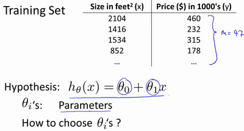

## 1. 什么是机器学习？

​	第一个机器学习的定义来自于**Arthur Samuel**。他定义机器学习为，在进行特定编程的情况下，给予计算机学习能力的领域。

​	**Tom**定义的机器学习是**一个程序被认为能从经验E中学习，解决任务T，达到性能度量值P，当且仅当，有了经验E后，经过P评判，程序在处理T时的性能有所提升**。我认为经验**E** 就是程序上万次的自我练习的经验而任务**T** 就是下棋。性能度量值**P**呢，就是它在与一些新的对手比赛时，赢得比赛的概率。

​	不同类型的学习算法，目前主要的两种类型被我们称之为**监督学习**和**无监督学习**。

### 1.1 监督学习

​	将训练集喂给机器学习算法，输出一个假设函数 h，然后新输入一个自变 x 到假设函数内，然后输出一个因变量 y 值。

​	我们给学习算法一个数据集，这个数据集由正确的答案组成，数据集中的每一个样本都有相应正确的答案，学习算法通过不断拟合这些样本数据，最后再根据样本数据推理出正确答案（监督学习，主要用于**分类问题**及其**回归问题**）。

### 1.2 无监督学习

​	无监督学习中没有任何的标签或者是有相同的标签或者就是没标签。所以我们已知数据集，却不知如何处理，也未告知每个数据点是什么。别的都不知道，就是一个数据集。你能从数据中找到某种结构吗？针对数据集，无监督学习就能判断出数据有两个不同的聚集簇。这是一个，那是另一个，二者不同。是的，无监督学习算法可能会把这些数据分成两个不同的簇。所以叫做**聚类算法**。事实证明，它能被用在很多地方。

## 2. 单变量线性回归(Linear Regression with One Variable)

​	所谓线性回归：指因变量(y)与自变量(x)之间存在线性关系，我们可以用某一线性回归模型来拟合因变量与自变量的数值，并采用某种估计方法来确定模型的有关参数来得到具体的回归方程。如果在回归分析中，只包含一个自变量与一个因变量并且两者的关系可以用一条直线来近似表示，那么这种回归称为单变量线性回归，如果回归分析中包含两个或者两个以上的自变量，并且自变量和因变量之间存在线性关系，则称之为多变量线性回归。

在统计学上把单变量线性回归和多变量线性回归统称为一元线性回归、多元线性回归。

单变量线性回归：是在两个变量之间建立类似线性方程的拟合模型，以一个变量去预测另一个变量。他之所以简单是因为涉及的变量比较少仅仅是两个变量拟合与预测，而不像决策树、K近邻等算法通常要考虑多维变量之间的关系。

### 2.1 模型表示

​	单变量线性回归指的是只有一个自变量。有如下这样一个训练集，特征为房子的大小，因变量是房价。那么对于一个新的房子的大小，我们如何根据历史的数据来预测出来该房子的价格呢？

​	

$$
m 代表训练集中实例的数量\\
x 代表特征/输入变量\\
y 代表目标变量/输出变量\\
(x,y)代表训练集中的实例\\
(x^(i^),y^(i^))代表第i个观察实例\\
h代表学习算法的解决方案或函数也称为假设（hypothesis）\\
$$
​	根据如上数据：我们在一个xy轴上面标注这些点，然后预设一个假设函数：

​	选择不同的参数值，就会得到不同的直线。**对于假设函数所预测出来的值和实际值之间的差距就是建模误差，也就是存在着一个代价函数。**
代价函数的公式如下：

​	我们的目标就是减少假设函数预测数来的值和实际值之间的差距，也就是让代价函数最小。而让**代价函数**最小，就需要我们选择合适的参数值。

​	这个方法定义的J(θ)在最优化理论中称为凸（Convex）函数，即全局只有一个最优解，然后通过梯度下降算法找到最优解即可，梯度下降算法的函数如下：

### 2.2 代价函数

​	

​	
$$
在线性回归当中我们有像这样一个数据集，{m}代表了训练样本的数量比如{m=47},\\
而我们的假设函数也就是用来进行预测的函数，是这样的线性函数形式：\\
{h_\theta(x)}={\theta_0}+{\theta_1x}。
$$
​	我们现在要做的便是为我们的模型选择合适的**参数**（**parameters**）,在房价问题这个例子中便是直线的斜率和在y轴上的截距

​	我们选择的参数决定了我们得到的直线相对于我们的训练集的准确程度，模型所预测的值与训练集中实际值之间的差距（下图中蓝线所指）就是**建模误差**（**modeling error**）。

​	

​	
$$
我们的目标便是选择出可以使得建模误差的平方和能够最小的模型参数。 即使得代价函数。\\{J(\theta_0,\theta_1)}={\frac{1}{2m}\sum_{i = 1} (h_\theta(x^i)-(y^i))}^2 最小 \\
我们绘制一个等高线图，三个坐标分别为 \theta_0 和 \theta_1 和 J(\theta_0,\theta_1)
$$
​	

​	代价函数也被称作平方误差函数，有时也被称为平方误差代价函数。我们之所以要求出误差的平方和，是因为误差平方代价函数，对于大多数问题，特别是回归问题，都是一个合理的选择。还有其他的代价函数也能很好地发挥作用，但是平方误差代价函数可能是解决回归问题最常用的手段了。

### 2.3 代价函数的直观理解 l

​	

### 2.4 代价函数的直观理解 II

代价函数的样子，等高线图，则可以看出在三维空间中存在一个使得最小的点。

​	通过这些图形，我希望你能更好地理解这些代价函数所表达的值是什么样的，它们对应的假设是什么样的，以及什么样的假设对应的点，更接近于代价函数的最小值。

​	当然，我们真正需要的是一种有效的算法，能够自动地找出这些使代价函数取最小值的参数和来。

​	

