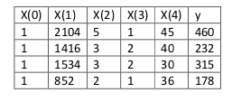

## 4. 多变量线性回归(Linear Regression with Multiple Variables)

### 4.1 多维特征

符号约定：


$$
n : 特征的数量 \\
\theta:参数 \\
𝑥(𝑖) : 第𝑖 个训练实例，是特征矩阵中的第𝑖行，是一个向量（ vector）\\
x^{(i)}_j:特征矩阵中第i行的第j个,第i个训练实例的第j个特征 \\
支持多变量的假设函数h： ℎ𝜃(𝑥) = 𝜃0 + 𝜃1𝑥1 + 𝜃2𝑥2+. . . +𝜃𝑛𝑥𝑛\\
$$


​	
$$
第二个样本的第二个特征 x^{(2)}_2=3 第二个样本的第三个特征 x^{(2)}_3=2 \\
假设函数中有n+1个参数和n个变量，为了使得公式能够简化，引入x_0=1，则公式为 \\
{\theta_0}{x0}+{\theta1}{x1}+{\theta2}{x2}+...{{\theta}n}{xn} \\
此时模型中的参数是一个𝑛 + 1维的向量，任何一个训练实例也都是𝑛 + 1维的向量， \\
特征矩阵𝑋的维度是 𝑚 ∗ (𝑛 + 1)。 所以公式可以简化为：ℎ𝜃(𝑥) = 𝜃^𝑇𝑋， \\
其中上标𝑇代表矩阵转置
$$
​	

​	

### 4.2 多变量梯度下降

$$
与单变量线性回归类似，在多变量线性回归中，我们也构建一个代价函数，\\
则这个代价函数是所有建模误差的平方和，即： \\
{J({\theta_0},{\theta_1},...{\theta_n})}={\frac{1}{2m}}{\sum \limits_{i=1}^{{m}}}({h_\theta}({x^{(i)}})-{y^{(i)}}), \\
其中 {h_\theta}(x)={\theta^T}X={\theta_0}+{\theta_1}{x_1}+{\theta_2}{x_2}+...+{\theta_n}{x_n}
$$


```python
def computeCost(X, y, theta):
    inner = np.power(((X * theta.T) - y), 2)
    return np.sum(inner) / (2 * len(X))	
```


### 4.3 梯度下降实践1-特征缩放（归一化）

在我们面对多维特征问题的时候，我们要保证这些特征都具有相近的尺度，这将帮助梯度下降算法更快地收敛。

以房价问题为例，假设我们使用两个特征，房屋的尺寸和房间的数量，尺寸的值为 0-2000平方英尺，而房间数量的值则是0-5，以两个参数分别为横纵坐标，绘制代价函数的等高线图能，看出图像会显得很扁，梯度下降算法需要非常多次的迭代才能收敛。


解决的方法是尝试将所有特征的尺度都尽量缩放到-1到1之间。如图：


$$
最简单的方法是令 x_n={\frac{{x_n}-u_n}{sn}}其中{u_n}是平均值，{s_n}是标准差
$$

### 4.4 梯度下降法实践2-学习率

​	梯度下降算法收敛所需要的迭代次数根据模型的不同而不同，我们不能提前预知，我们可以绘制迭代次数和代价函数的图表来观测算法在何时趋于收敛。


也有一些自动测试是否收敛的方法，例如将代价函数的变化值与某个阀值（例如0.001）进行比较，但通常看上面这样的图表更好。

梯度下降算法的每次迭代受到学习率的影响，如果学习率过小，则达到收敛所需的迭代次数会非常高；如果学习率过大，每次迭代可能不会减小代价函数，可能会越过局部最小值导致无法收敛。

通常可以考虑尝试些学习率：
$$
a=0.01,0.03,0.1,1,3,10
$$

### 4.5 特征和多项式回归

如房价预测问题，


$$
{{h_\theta}({x})}={\theta_0}+{{\theta_1}*frontage}+{{\theta_2}*depth} \\
x_1=frontage(临界宽度) x_2=depth(纵向深度) \\
x=frontage*depth=area(面积) \\
则：{{h_\theta}({x})}={\theta_0}+{{\theta_1}x},线性回归并不适合与所有数据，\\有时我们需要曲线来适应我们的数据，比如一个二次方程模型：\\
{h_\theta{(x)}}={\theta_0}+{{\theta_1}x_1}+{{\theta_2}x^2_2} 或者三次模型：\\{h_\theta{(x)}}={\theta_0}+{{\theta_1}x_1}+{{\theta_2}x^2_2}+{{\theta_2}x^3_3}
$$
​	这里为了让函数曲线拥有更好的拟合程度，添加,，特征变量增加函数的适用性（一次方程，二次方程函数)


$$
通常我们需要先观察数据然后再决定准备尝试怎样的模型，另外，我们可以令：x_2=x^2_2 \\
,x_3=x^3_3,从而将模型转换为线性回归模型。根据函数图形特性，我们还可以使：\\
{h{\theta}(x)}={\theta_0}+{\theta_1{(size)}}+{\theta_2{(size)^2}} .或者\\ {h{\theta}(x)}={\theta_0}+{\theta_1{(size)}}+{\theta_2{\sqrt{size}}} \\
注：如果我们采用多项式回归模型，在运行梯度下降算法前，特征缩放非常有必要。
$$

### 4.6 正规方程

到目前为止，我们都在使用梯度下降算法，但是对于某些线性回归问题，正规方程方法是更好的解决方案。如：


$$
正规方程是通过求解下面的方程来找出使得代价函数最小的参数的：{\frac{\partial }{\partial{\theta_j}}}J(\theta_j)=0。\\
 假设我们的训练集特征矩阵为X(包含了x_0=1)并且我们的训练集结果为向量y，\\则利用正规方程解出向量{\theta}={({X^T}{X})^{-1}}{X^T}{y}。上标T代表矩阵转置，上标-1\\代表矩阵的逆。设矩阵A={X^T}X,则：({X^T}{X})^{-1}=A^{-1}以下表示数据为：\\
 解释：\\
 {({X^T}{X})^{-1}}:矩阵平方 \\
 {X^T}: 转置矩阵 ：矩阵-45°的镜像\\
 转置矩阵的特点(图解)： \\
（1）转置矩阵的行数是原矩阵的列数，转置矩阵的列数是原矩阵的行数； \\
（2）转置矩阵下标（i，j）的元素对应于原矩阵下标（j，i）的元素。\\
向量y:n*1 的矩阵：这里是数据集所有的结果标签组成 \\
$$
转置矩阵


例：


即：



运用正规方程方法求解参数：


​	注：对于那些不可逆的矩阵（通常是因为特征之间不独立，如同时包含英尺为单位的尺寸和米为单位的尺寸两个特征，也有可能是特征数量大于训练集的数量），正规方程方法是不能用的。

梯度下降与正规方程的比较：

| 梯度下降                   | 正规方程                                                     |
| :------------------------- | :----------------------------------------------------------- |
| 需要选择学习率             | 不需要                                                       |
| 需要多次迭代               | 一次运算得出                                                 |
| 当特征数量大时也能较好适用 | 需要计算 如果特征数量n较大则运算代价大，因为矩阵逆的计算时间复杂度为，通常来说当小于10000 时还是可以接受的 |
| 适用于各种类型的模型       | 只适用于线性模型，不适合逻辑回归模型等其他模型               |

​	总结一下，只要特征变量的数目并不大，标准方程是一个很好的计算参数的替代方法。具体地说，只要特征变量数量小于一万，我通常使用标准方程法，而不使用梯度下降法。

​	随着我们要讲的学习算法越来越复杂，例如，当我们讲到分类算法，像逻辑回归算法，我们会看到，实际上对于那些算法，并不能使用标准方程法。对于那些更复杂的学习算法，我们将不得不仍然使用梯度下降法。因此，梯度下降法是一个非常有用的算法，可以用在有大量特征变量的线性回归问题。或者我们以后在课程中，会讲到的一些其他的算法，因为标准方程法不适合或者不能用在它们上。但对于这个特定的线性回归模型，标准方程法是一个比梯度下降法更快的替代算法。所以，根据具体的问题，以及你的特征变量的数量，这两种算法都是值得学习的。

正规方程的**python**实现：

```python
import numpy as np
    
 def normalEqn(X, y):
    
   theta = np.linalg.inv(X.T@X)@X.T@y #X.T@X等价于X.T.dot(X)
    
   return theta
```


### 4.7 正规方程及不可逆性


