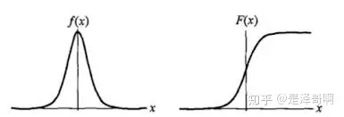
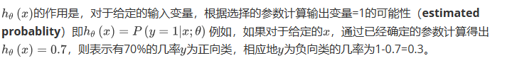

## 5. 逻辑回归(Logistic Regression)

​	Logistic Regression 虽然被称为回归，但其实际上是分类模型，并常用于二分类。Logistic Regression 因其简单、可并行化、可解释强深受工业界喜爱。

​	Logistic 回归的本质是：假设数据服从这个分布，然后使用极大似然估计做参数的估计。
$$
logistic 分布是一种连续型的概率分布，其中分布函数和密度函数分别是：\\
F(x)=P(X<=x)={\frac{1}{1+e^{-(x-u)/{\gamma}}}} \\
F(x)=F^{'}(X<=x)={\frac{e^{-(x-u)/{\gamma}}}{{\gamma}{(1+e^{-(x-u)/{\gamma}})^2}}}\\
其中，u表示位置参数 {\gamma}>0为形状参数。\\
Logistic 分布是由其位置和尺度参数定义的连续分布。Logistic 分布的形状与正态分布的形状相似，\\
但是 Logistic 分布的尾部更长，所以我们可以使用 Logistic 分布来建模比正态分布具有更长尾部和更\\
高波峰的数据分布。在深度学习中常用到的 Sigmoid 函数就是 Logistic 的分布函数在u=0,{\gamma}=1的特殊形式。
$$



### 5.1 分类问题

$$
在分类问题中 ，你要预测的变量y是离散的值，我们讲学习一种叫做\\逻辑回归(Logistic Regression) 的算法，这是目前最流行使用最广泛的一种学习算法。\\
$$

​	在分类问题中，我们尝试预测的是结果是否属于某一个类（例如正确或错误）。分类问题的例子有：判断一封电子邮件是否是垃圾邮件；判断一次金融交易是否是欺诈；之前我们也谈到了肿瘤分类问题的例子，区别一个肿瘤是恶性的还是良性的。


二元分类问题：
$$
我们将因变量(dependent variable)可能属于的两个类分别称为负向类\\（negative class）和正向类（positive class），则因变量y{\in}0,1 ，\\其中 0 表示负向类，1 表示正向类。
$$


​	如果我们要用线性回归算法来解决一个分类问题，对于分类，y取值为0或1，但如果你使用的是线性回归,那么假设函数的输出值可能大于1，或者远小于1，即使所有训练样本的标签y都等于0或1。尽管我们知道标签应该取值0 或者1，但是如果算法得到的值远大于1或者远小于0的话，就会感觉很奇怪。所以\\我们在接下来的要研究的算法就叫做逻辑回归算法，这个算法的性质是：它的输出值永远在0到 1 之间。

​	逻辑回归算法是分类算法，我们将它作为分类算法使用。有时候可能因为这个算法的名字中出现了“回归”使你感到困惑，但逻辑回归算法实际\\上是一种分类算法，它适用于标签  取值离散的情况，如：1 0 0 1。

### 5.2 假说表示

​	假设函数的表达式，在分类问题中，要用什么样的函数来表示我们的假设。此前我们说过，希望我们的分类器的输出值在0和1之间，因此，我们希望想出一个满足某个性质的假设函数，这个性质是它的预测值要在0和1之间。

​	回顾在一开始提到的乳腺癌分类问题，我们可以用线性回归的方法求出适合数据的一条直线：


​	根据线性回归模型我们只能预测连续的值，然而对于分类问题，我们需要输出0或1，我们可以预测：

​	
$$
	当h_{\theta}{(x)}>=0.5时，预测y=1 \\
		当h_{\theta}{(x)}<0.5时，预测y=0 \\
$$
​	对于上图所示的数据，这样的一个线性模型似乎能很好地完成分类任务。假使我们又观测到一个非常大尺寸的恶性肿瘤，将其作为实例加入到我们的训练集中来，这将使得我们获得一条新的直线。


​	这时，再使用0.5作为阀值来预测肿瘤是良性还是恶性便不合适了。可以看出，线性回归模型，因为其预测的值可以超越[0,1]的范围，并不适合解决这样的问题。

#### 5.2.1 sigmoid 函数

​	
$$
这里我们现在引入一个新的模型。逻辑回归，该模型的输出变量范围始终在0-1之间，\\逻辑回归的假设是：h_{\theta}{(x)}=g({\theta^{T}X})，其中：X：代表特征向量,g代表逻辑函数\\
（logistic function)是一个常用的逻辑函数为s形函数（sigmoid  function）,\\
公式为：g(z)={\frac{1}{1+{e^{-z}}} }
$$
**python代码：**

```python
import numpy as np
def sigmoid(z):
   return 1 / (1 + np.exp(-z))
```

**sigmoid 函数图像**




### 5.3 判定边界

​	
