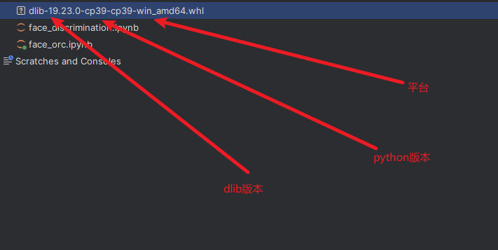

# dlib 安装报错

报错信息：

```cmd
Building wheels for collected packages: dlib
  Building wheel for dlib (pyproject.toml) ... error
  error: subprocess-exited-with-error
  
  × Building wheel for dlib (pyproject.toml) did not run successfully.
  │ exit code: 1
  ╰─> [143 lines of output]
      running bdist_wheel
      running build
      running build_ext
      <string>:125: DeprecationWarning: distutils Version classes are deprecated. Use packaging.version instead.
      Building extension for Python 3.11.5 | packaged by Anaconda, Inc. | (main, Sep 11 2023, 13:26:23) [MSC v.1916 64 bit (AMD64)]
      Invoking CMake setup: 'cmake C:\Users\Administrator\AppData\Local\Temp\pip-install-xvese17p\dlib_f39a18e5a3944393a12f0221b30c6b30\tools\python -DCMAKE_LIBRARY_OUTPUT_DIRECTORY=C:\Users\Administrator\AppData\Local\Temp\pip-
install-xvese17p\dlib_f39a18e5a3944393a12f0221b30c6b30\build\lib.win-amd64-cpython-311 -DPYTHON_EXECUTABLE=F:\minconda\python.exe -DCMAKE_LIBRARY_OUTPUT_DIRECTORY_RELEASE=C:\Users\Administrator\AppData\Local\Temp\pip-install-xve
1 涓\xaa璀﹀憡              1 涓\xaa閿欒\xaf\xaf
     
          宸茬敤鏃堕棿 00:00:00.27
        CMake will not be able to correctly generate this project.
      Call Stack (most recent call first):
        CMakeLists.txt:14 (project)


```

出现原因在于 python版本与 dlib 库 版本不兼容 

解决方案：



1. 查看python 版本 下载对应版本[dlib](https://pypi.org/simple/dlib/)文件
2. 进入环境 `pip install xxx.whl`


