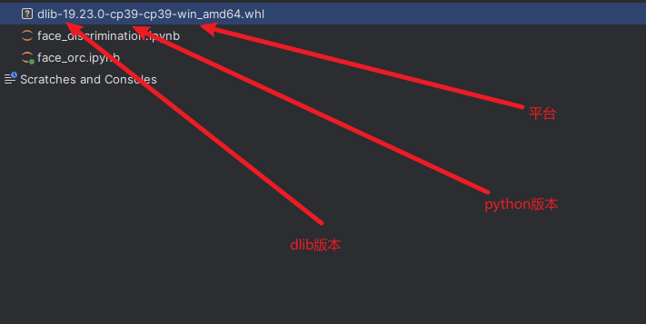
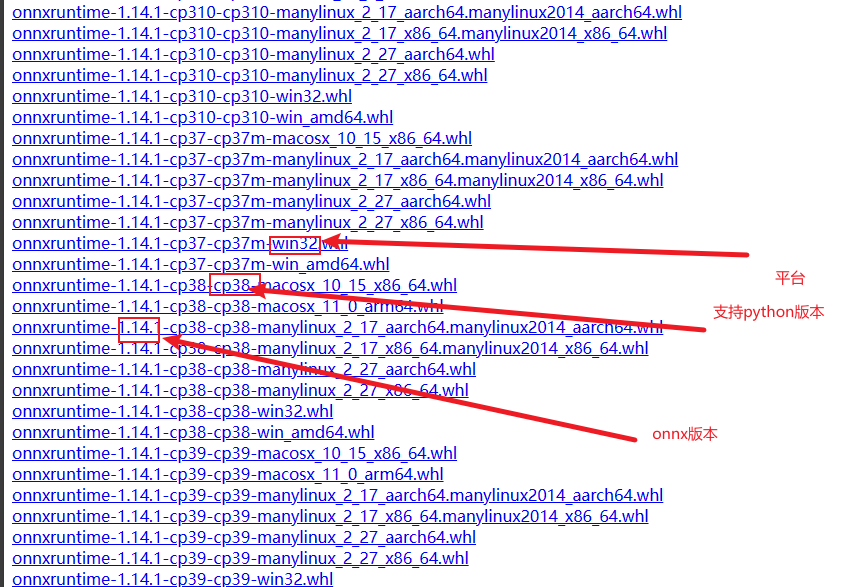

### 1. dlib 安装报错

**报错信息：**

```cmd
Building wheels for collected packages: dlib
  Building wheel for dlib (pyproject.toml) ... error
  error: subprocess-exited-with-error
  
  × Building wheel for dlib (pyproject.toml) did not run successfully.
  │ exit code: 1
  ╰─> [143 lines of output]
      running bdist_wheel
      running build
      running build_ext
      <string>:125: DeprecationWarning: distutils Version classes are deprecated. Use packaging.version instead.
      Building extension for Python 3.11.5 | packaged by Anaconda, Inc. | (main, Sep 11 2023, 13:26:23) [MSC v.1916 64 bit (AMD64)]
      Invoking CMake setup: 'cmake C:\Users\Administrator\AppData\Local\Temp\pip-install-xvese17p\dlib_f39a18e5a3944393a12f0221b30c6b30\tools\python -DCMAKE_LIBRARY_OUTPUT_DIRECTORY=C:\Users\Administrator\AppData\Local\Temp\pip-
install-xvese17p\dlib_f39a18e5a3944393a12f0221b30c6b30\build\lib.win-amd64-cpython-311 -DPYTHON_EXECUTABLE=F:\minconda\python.exe -DCMAKE_LIBRARY_OUTPUT_DIRECTORY_RELEASE=C:\Users\Administrator\AppData\Local\Temp\pip-install-xve
1 涓\xaa璀﹀憡              1 涓\xaa閿欒\xaf\xaf
     
          宸茬敤鏃堕棿 00:00:00.27
        CMake will not be able to correctly generate this project.
      Call Stack (most recent call first):
        CMakeLists.txt:14 (project)


```

出现原因在于 python版本与 dlib 库 版本不兼容 

**解决方案：**



1. 查看python 版本 下载对应版本[dlib](https://pypi.org/simple/dlib/)文件
2. 进入环境 `pip install xxx.whl`


### 2. cuda 报错（RuntimeError: CUDA error: unknown error）

**错误代码：**

```cmd
  File "G:\wav2lip384\preprocess.py", line 85, in mp_handler
    process_video_file(vfile, args, gpu_id)
  File "G:\wav2lip384\preprocess.py", line 59, in process_video_file
    preds = fa[gpu_id].get_detections_for_batch(np.asarray(fb))
  File "G:\wav2lip384\face_detection\api.py", line 66, in get_detections_for_batch
    detected_faces = self.face_detector.detect_from_batch(images.copy())
    bboxlists = batch_detect(self.face_detector, images, device=self.device)
  File "G:\wav2lip384\face_detection\detection\sfd\detect.py", line 65, in batch_detect
    imgs = torch.from_numpy(imgs).float().to(device)
RuntimeError: CUDA error: unknown error
Compile with `TORCH_USE_CUDA_DSA` to enable device-side assertions.

```

**为什么报错：**

​	1. torch 与torchmetrics ，及其torchversion 之间的版本不兼容

**解决方案：**

 	1. 卸载 torch 与torchmetrics ，及其torchversion
 	2. 三个库版本需要保持一致


### 3. pip 安装onnxruntime 指定版本一直报错找不到包？


**为什么报错：**

​	python 版本与需要安装的onnxruntime版本不兼容 

​	[Links for onnxruntime (tsinghua.edu.cn)](https://pypi.tuna.tsinghua.edu.cn/simple/onnxruntime/)



**解决方案：**

1. 更改python版本（不推荐）
2. 查询当前python版本对于版本onnxruntime版本
