## 1. 什么是机器学习？

​	第一个机器学习的定义来自于**Arthur Samuel**。他定义机器学习为，在进行特定编程的情况下，给予计算机学习能力的领域。

​	**Tom**定义的机器学习是**一个程序被认为能从经验E中学习，解决任务T，达到性能度量值P，当且仅当，有了经验E后，经过P评判，程序在处理T时的性能有所提升**。我认为经验**E** 就是程序上万次的自我练习的经验而任务**T** 就是下棋。性能度量值**P**呢，就是它在与一些新的对手比赛时，赢得比赛的概率。

​	不同类型的学习算法，目前主要的两种类型被我们称之为**监督学习**和**无监督学习**。

### 1.1 监督学习

​	将训练集喂给机器学习算法，输出一个假设函数 h，然后新输入一个自变 x 到假设函数内，然后输出一个因变量 y 值。

​	我们给学习算法一个数据集，这个数据集由正确的答案组成，数据集中的每一个样本都有相应正确的答案，学习算法通过不断拟合这些样本数据，最后再根据样本数据推理出正确答案（监督学习，主要用于**分类问题**及其**回归问题**）。

### 1.2 无监督学习

​	无监督学习中没有任何的标签或者是有相同的标签或者就是没标签。所以我们已知数据集，却不知如何处理，也未告知每个数据点是什么。别的都不知道，就是一个数据集。你能从数据中找到某种结构吗？针对数据集，无监督学习就能判断出数据有两个不同的聚集簇。这是一个，那是另一个，二者不同。是的，无监督学习算法可能会把这些数据分成两个不同的簇。所以叫做**聚类算法**。事实证明，它能被用在很多地方。

## 2. 单变量线性回归(Linear Regression with One Variable)

​	所谓线性回归：指因变量(y)与自变量(x)之间存在线性关系，我们可以用某一线性回归模型来拟合因变量与自变量的数值，并采用某种估计方法来确定模型的有关参数来得到具体的回归方程。如果在回归分析中，只包含一个自变量与一个因变量并且两者的关系可以用一条直线来近似表示，那么这种回归称为单变量线性回归，如果回归分析中包含两个或者两个以上的自变量，并且自变量和因变量之间存在线性关系，则称之为多变量线性回归。

在统计学上把单变量线性回归和多变量线性回归统称为一元线性回归、多元线性回归。

单变量线性回归：是在两个变量之间建立类似线性方程的拟合模型，以一个变量去预测另一个变量。他之所以简单是因为涉及的变量比较少仅仅是两个变量拟合与预测，而不像决策树、K近邻等算法通常要考虑多维变量之间的关系。

### 2.1 模型表示

​	单变量线性回归指的是只有一个自变量。有如下这样一个训练集，特征为房子的大小，因变量是房价。那么对于一个新的房子的大小，我们如何根据历史的数据来预测出来该房子的价格呢？

​	

$$
m 代表训练集中实例的数量\\
x 代表特征/输入变量\\
y 代表目标变量/输出变量\\
(x,y)代表训练集中的实例\\
(x^(i^),y^(i^))代表第i个观察实例\\
h代表学习算法的解决方案或函数也称为假设（hypothesis）\\
$$
​	根据如上数据：我们在一个xy轴上面标注这些点，然后预设一个假设函数：

​	选择不同的参数值，就会得到不同的直线。**对于假设函数所预测出来的值和实际值之间的差距就是建模误差，也就是存在着一个代价函数。**
代价函数的公式如下：

​	我们的目标就是减少假设函数预测数来的值和实际值之间的差距，也就是让代价函数最小。而让**代价函数**最小，就需要我们选择合适的参数值。

​	这个方法定义的J(θ)在最优化理论中称为凸（Convex）函数，即全局只有一个最优解，然后通过梯度下降算法找到最优解即可，梯度下降算法的函数如下：

### 2.2 代价函数

​	

​	
$$
在线性回归当中我们有像这样一个数据集，{m}代表了训练样本的数量比如{m=47},\\
而我们的假设函数也就是用来进行预测的函数，是这样的线性函数形式：\\
{h_\theta(x)}={\theta_0}+{\theta_1x}。
$$
​	我们现在要做的便是为我们的模型选择合适的**参数**（**parameters**）,在房价问题这个例子中便是直线的斜率和在y轴上的截距

​	我们选择的参数决定了我们得到的直线相对于我们的训练集的准确程度，模型所预测的值与训练集中实际值之间的差距（下图中蓝线所指）就是**建模误差**（**modeling error**）。

​	

​	
$$
我们的目标便是选择出可以使得建模误差的平方和能够最小的模型参数。 即使得代价函数。\\{J(\theta_0,\theta_1)}={\frac{1}{2m}\sum_{i = 1} (h_\theta(x^i)-(y^i))}^2 最小 \\
我们绘制一个等高线图，三个坐标分别为 \theta_0 和 \theta_1 和 J(\theta_0,\theta_1)
$$
​	

​	代价函数也被称作平方误差函数，有时也被称为平方误差代价函数。我们之所以要求出误差的平方和，是因为误差平方代价函数，对于大多数问题，特别是回归问题，都是一个合理的选择。还有其他的代价函数也能很好地发挥作用，但是平方误差代价函数可能是解决回归问题最常用的手段了。

### 2.3 代价函数的直观理解 l

​	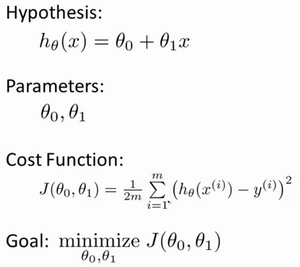

### 2.4 代价函数的直观理解 II

代价函数的样子，等高线图，则可以看出在三维空间中存在一个使得最小的点。

​	当然，我们真正需要的是一种有效的算法，能够自动地找出这些使代价函数取最小值的参数和来。

​	**简单来说，即通过当前模型得到的预测值和实际值之间的差。这个差是关于模型参数的函数，希望它越小越好**

### 2.5 梯度下降

​	梯度下降是一个用来求函数最小值的算法，我们使用梯度下降算法来求出代价函数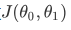 的最小值。

​	梯度下降背后的思想是：开始时我们随机选择一个参数的组合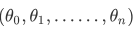计算代价函数，然后我们寻找下一个能让代价函数值下降最多的参数组合。我们持续这么做直到到到一个局部最小值（**local minimum**），因为我们并没有尝试完所有的参数组合，所以不能确定我们得到的局部最小值是否便是全局最小值（**global minimum**)，选择不同的初始参数组合，可能会找到不同的局部最小值。

​	批量梯度下降（**batch gradient descent**）算法的公式为：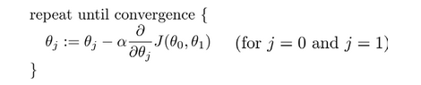

​	其中是学习率（**learning rate**），它决定了我们沿着能让代价函数下降程度最大的方向向下迈出的步子有多大，在批量梯度下降中，我们每一次都同时让所有的参数减去学习速率乘以代价函数的导数。

​	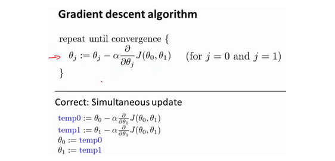

​	
$$
在梯度下降算法中，还有一个更微妙的问题，梯度下降中，我们要更新 \theta_0 和\\ \theta_1、、 ,当j=0 和j=1 时，会产生更新,所以你将更新j(\theta_0)和j(\theta_1)\\实现梯度下降算法的微妙之处是，在这个表达式中，如果你要更新这个等式，你需\\要同时更新\theta_0 和\theta_1 ，在这个等式中 ，我们要这么更新 \theta_0:=\theta_0，并更新\theta_1 :=\theta_1.
$$

### 2.6 梯度下降的直观感受

​	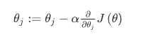

​	
$$
描述：对\theta赋值，使得J(\theta)按梯度下降最快方向进行，一直迭代下去，\\最终得到局部最小值，其中as=是学习率(learning rate),\\它决定了我们沿着能能让代价函数下降程度最大的方向下迈出的步有多大。
$$

​		**梯度下降可以理解为如何寻找到函数斜率最小的点**，**通过求得函数斜率最小点求出代价函数最小值。注意这里求出的点属于局部最低点。**

​		对于这个问题，求导的目的，基本上可以说取这个红点的切线，就是这样一条红色的直线，刚好与函数相切于这一点，让我们看看这条红色直线的斜率，就是这条刚好与函数曲线相切的这条直线，这条直线的斜率正好是这个三角形的高度除以这个水平长度，现在，这条线有一个正斜率，也就是说它有正导数，因此，我得到的新的，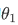更新后等于减去一个正数乘以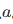

​	这就是梯度下降法的更新规则：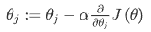

​	**如果太小或太大会出现什么情况？：**

​		**如果太小了，学习速率太小，结果就是只能一样一点点地挪动，去努力接近最低点，这样就需要很多步才能到达最低点，**所以如果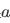太小的话，可能会很慢，因为它会一点点挪动，它会需要很多步才能到达全局最低点。

​		**如果太大，那么梯度下降法可能会越过最低点，甚至可能无法收敛，下一次迭代又移动了一大步，越过一次，又越过一次，一次次越过最低点，直到你发现实际上离最低点越来越远，所以，如果太大，它会导致无法收敛，甚至发散。**

​	现在，我还有一个问题，当我第一次学习这个地方时，如果我们预先把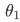放在一个局部的最低点，你认为下一步梯度下降法会怎样工作？

​	假设你将初始化在局部最低点，在这儿，它已经在一个局部的最优处或局部最低点。结果是局部最优点的导数将等于零，因为它是那条切线的斜率。这意味着你已经在局部最优点，它使得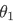不再改变，也就是新的等于原来的，因此，如果你的参数已经处于局部最低点，那么梯度下降法更新其实什么都没做，它不会改变参数的值。这也解释了为什么即使学习速率保持不变时，梯度下降也可以收敛到局部最低点。

​	我们来看一个例子，这是代价函数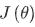。

​		在梯度下降法中，当我们接近局部最低点时，梯度下降法会自动采取更小的幅度，这是因为当我们接近局部最低点时，很显然在局部最低时导数等于零，所以当我们接近局部最低时，导数值会自动变得越来越小，所以梯度下降将自动采取较小的幅度，这就是梯度下降的做法。所以实际上没有必要再另外减小

​	**梯度下降算法，你可以用它来最小化任何代价函数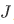，不只是线性回归中的代价函数。**

### 2.7 梯度下降的线性回归

​	梯度下降是很常用的算法，它不仅被用在线性回归上和线性回归模型、平方误差代价函数。

​	现在我们要将梯度下降和代价函数结合。我们将用到此算法，并将其应用于具体的拟合直线的线性回归算法里。

​	梯度下降算法和线性回归算法比较如图：

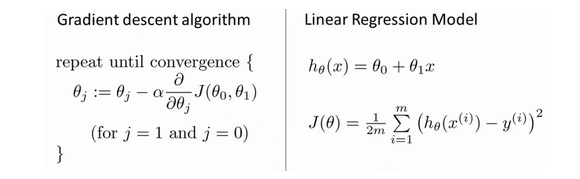

​	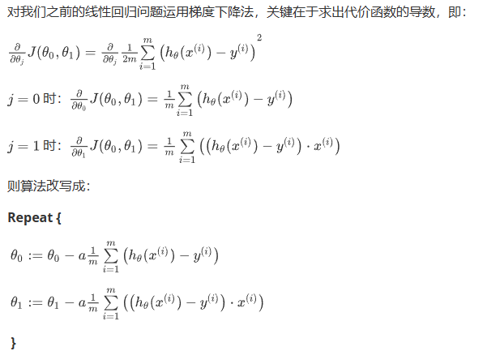

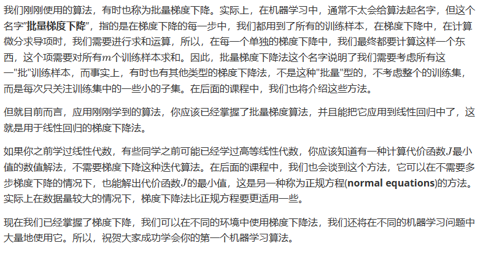

## 3. 线性代数

### 3.1 矩阵和向量

​	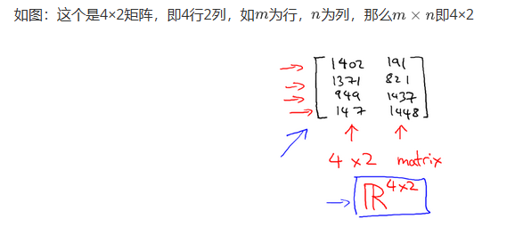

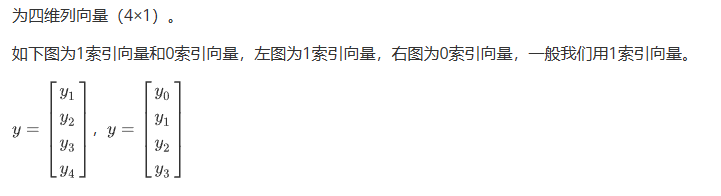

### 3.2 加法和标量乘法

​	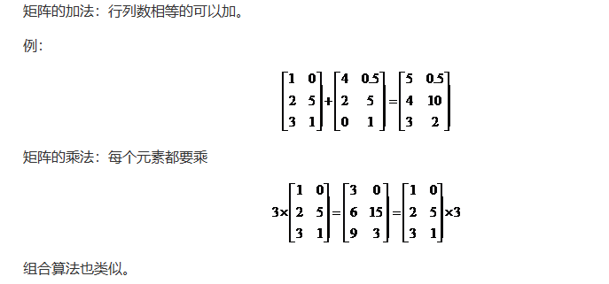

### 3.3 矩阵向量乘法

​	**矩阵（m \*n）与向量（m\*n）相乘需要注意:矩阵的列数需要与响亮的行数相同才能进行运算**

​	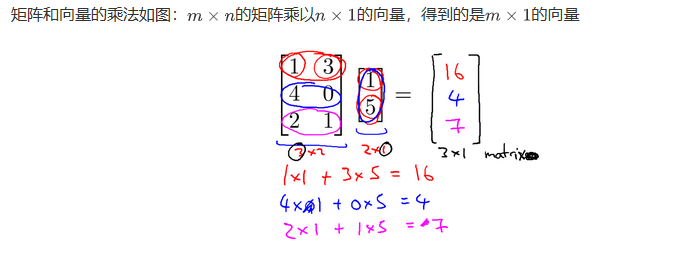

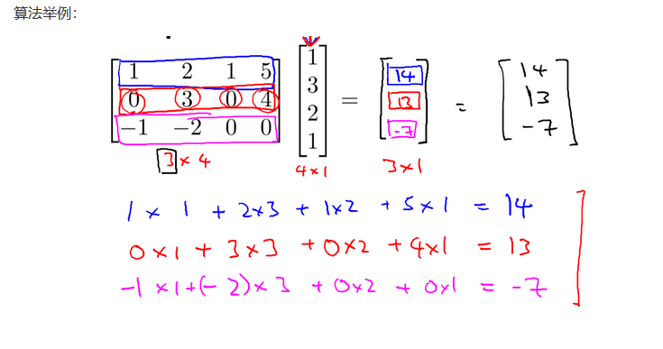

### 3.4 矩阵乘法

​	矩阵乘法： 矩阵(m\*n) \* 矩阵（n\*o）= 矩阵(m\*o)

​	举例：

​	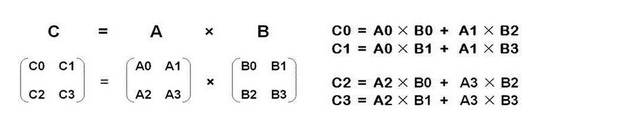

### 3.5 矩阵乘法的性质

​	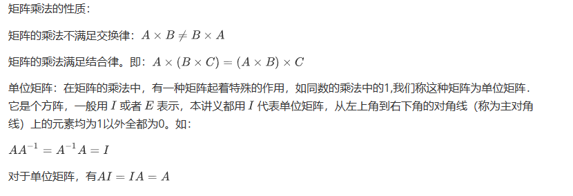

### 3.6 逆、转置

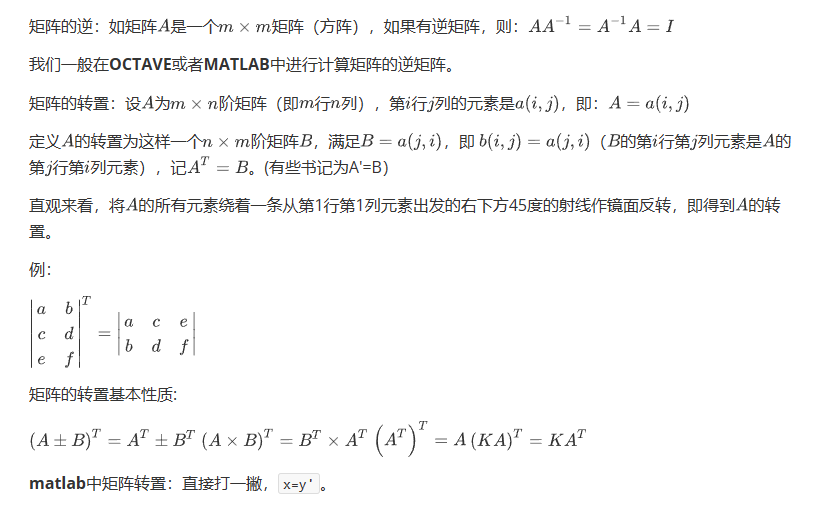
